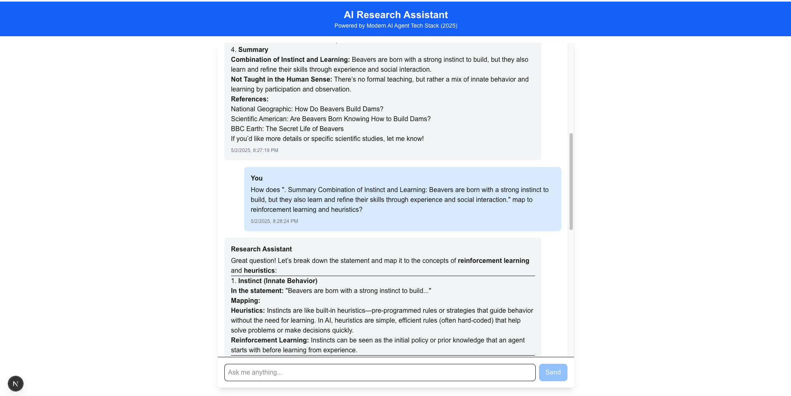

# Quick AI Research Agent Example

## Tech Stack

### Frontend

- **Next.js** - React framework for the web application
- **TypeScript** - Strongly typed programming language
- **Tailwind CSS** - Utility-first CSS framework
- **React Markdown** - Component for rendering markdown content
- **SSE (Server-Sent Events)** - Real-time communication for streaming responses

### Backend

- **Express.js** - Web server framework for Node.js
- **Node.js** - JavaScript runtime environment
- **TypeScript** - Type safety for JavaScript

### AI Agent Components

- **LangGraph.js** - Framework for building stateful AI agent workflows
- **LangChain** - Library for building LLM-powered applications

### Foundation Model

- **OpenAI API** - GPT-4o/GPT-3.5-turbo for reasoning and response generation

### Memory System

- **Pinecone** - Vector database for knowledge storage and retrieval
- **OpenAI Embeddings** - text-embedding-3-small for embedding generation

### Tool Integration

- **Tavily Search API** - Web search tool for retrieving real-time information

### Development & Monitoring

- **LangSmith** - Observability and debugging platform for AI agents

### Project Management

- **Git/GitHub** - Version control and collaboration

## Features

- Natural language query processing
- Real-time web search capabilities
- Contextual memory storage and retrieval
- Multi-step reasoning with agent orchestration
- Source citation for factual responses
- Streaming response UI for better user experience

---

## Screenshot

_Note: Made using Claude, Gemini - It took several iterations and manual searching due to bugs outputted by both LLMs (Claude 3.7 Sonnet, Gemini 2.5 Flash, Gemini 2.5 Pro)_
